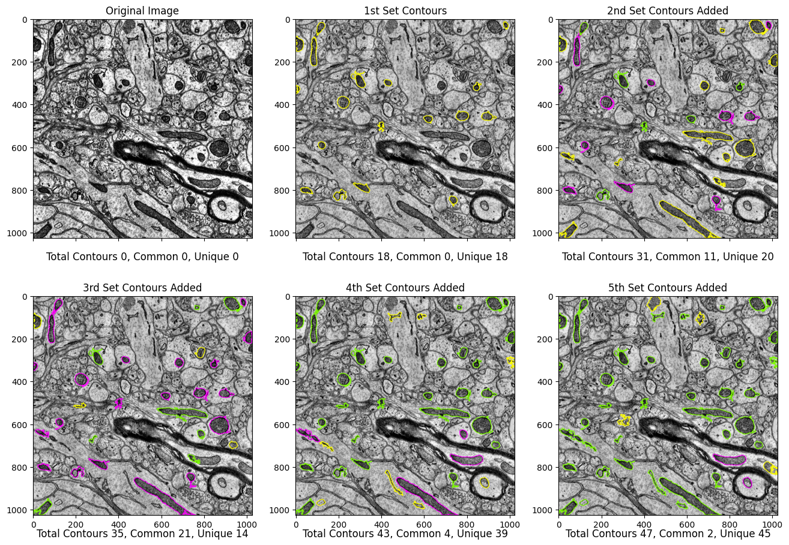
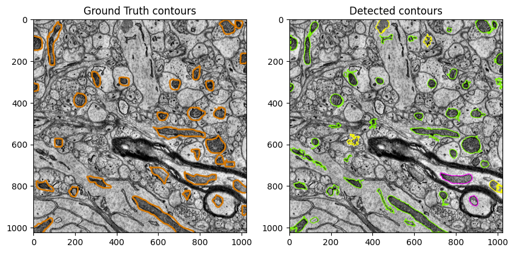
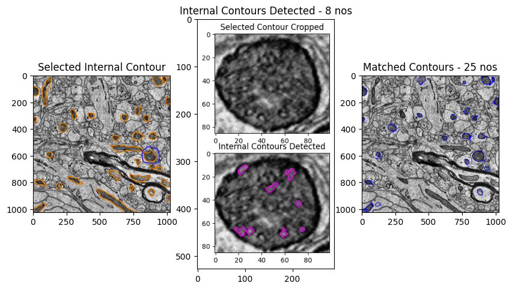
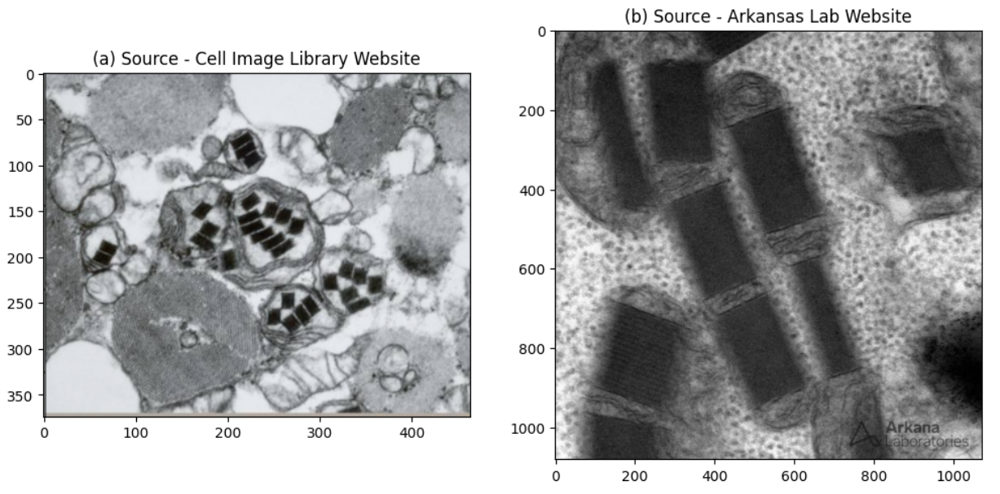

---
jupyter:
  jupytext:
    text_representation:
      extension: .md
      format_name: markdown
      format_version: '1.3'
      jupytext_version: 1.14.5
  kernelspec:
    display_name: bigearth
    language: python
    name: bigearth
---

# A Sustainable Approach for Segmentation of Irregular Shaped Cell Structures such as Mitochondria 


<u> Background <u>


Most of the approaches towards segmentation of irregular shaped cellular structures, including Mitochondria from Electron Microscopy Images have adopted Neural Networks such as CNN based Deep Learning Models. An approach by BioDataAnalysis GmbH (https://www.biodataanalysis.de/showcases-mitseg) first produce a superpixel oversegmentation of the image to reduce computational cost. It also uses SVMs to predict which superpixels contain mitochondria and which neighboring superpixels contain a mitochondrial boundary. More Deep Learning approaches can be seen in this paper (Shogo Suga et al., 2021) https://www.biorxiv.org/content/10.1101/2021.06.11.448083v1 and also (E.U.Mumcuoglu et al., 2012) https://onlinelibrary.wiley.com/doi/10.1111/j.1365-2818.2012.03614.x, and other similar exercises.


With the dramatic entry of LLMs and a huge number of generative AI based applications in recent months since the advent of ChatGPT 3, there are also concerns on the rising costs of using Cloud Computing GPU resources for running Deep Learning Models. This has also put the focus on the costs and sustainability of the Deep Learning approach itself. Prof. Neil Thomson, a Research scientist at MIT’s Computer Science and Artificial Intelligence Laboratory has suggested here https://spectrum.ieee.org/deep-learning-sustainability on substituting equations for neural network operations to make DL more sustainable. In an article in https://spectrum.ieee.org/deep-learning-computational-cost he has focussed on the cost of huge computational resources of Deep Learning. Professors Deep Jariwala and Benjamin Lee from the University of Pennslyvannia have written in this article https://penntoday.upenn.edu/news/hidden-costs-ai-impending-energy-and-resource-strain about the hidden costs of AI as an impending strain of energy and resources. While the are many more such articles cautioning on the exploding costs of AI, there surely seems to be a case for seeking an alternative approach, a sustainable and affordable one, preferably deployable on site, without expensive cloud or large data centers.


Whilst the domain of AI applications are huge, the aim here is to present an efficient alternative to Deep Learning models in the area of Computer Vision, by using standard Image Processing libraries, in this case, specifically, for segmentation of mitochondria in 2D EM images. The Images used are from an EPFL Dataset at https://www.epfl.ch/labs/cvlab/data/data-em/ which comprises 165 EM slices of a 1065x2048x1536 image stack, representing a 5x5x5µm section taken from the CA1 hippocampus region of the brain. Since this is only a demonstration of a particular alternative approach, only a single image is taken for the detection and segmentation. In this regard, there are various elements that represent this approach, which are described below.


<u>Non-Cloud Non-GPU Deployment<u>


The OpenCV Python Library is extensively used for all Image processing codes, such as thresholding, histogram equilization, detecting and drawing contours. OpenCV functions for Point Polygon Test and Shapes Matching are also utilized. It is of course obvious that when we seek to deploy these for a specific application, rather than a generic all encompassing segmentation of hundreds of objects, significant GPU processing power may not be needed. These aspects are key in this approach towards cost effective and sustainable deployment of the application.


<u>Incremental Contour Detection and Integration<u> 


BiodataAnalysis GmBH in their website https://www.biodataanalysis.de/showcases-mitseg has stated that the challenges of Mitochondria segmentation is that Mitochondria exhibit irregular shapes not easily captured and their texture can easily be confused with that of groups of vesicles or other organelles. Also, that Mitochondrial boundaries are difficult to distinguish from other membranes that share a similar appearance. As in a Convoloutional Neural Network based procedure, any alternative approach has to deal with detecting contours across different combinations of binary thresholding, pixel intensities, sizes and shapes. In this case, for detecting both external and internal contours, retrieval modes such as CV2.RETR_EXTERNAL or CV2.RETR_TREE or a combination is employed. Each run of the detection yields specific number of Contours, which may have common contours with other detection runs, and those unique to a single run. Hence, to incrementally detect all contours across the entire matrix of these varying combinations, we need to successfully segregate between any two runs the common contours and the unique contours. Here, 5 detection runs are performed and as seen in the figure below, and a total of 47 contours are detected. Next stage of code development can create a single function to perform multiple runs in a single go, thereby, similar to the case of a Deep Learning Model


<u>Comparison of Detection Results and Ground Truth<u>


Comparing the above with the human annotated ground truth for this image overlapped on the original, it can be seen that there are about 12 false positives, and, 3 contours not yet detected in these runs. These remaining contours can be detected through different settings of threshold and contour retrieval mode. Contour detection filters for minimum area, pixel intensities, extent and minimum height and width have been utilized. The false positives can be reduced through these measures, but, as mentioned in the BioDataAnalysis GmbH reference above, these visual cues are not descriminative enough. This calls for better critieria for the mitochondria segmentation, one that will not need filters, other than those known through research papers or references. 


<u>Internal Structures as Segmentation Criteria<u>


The article https://undark.org/2019/12/04/black-box-artificial-intelligence/ brings out the general concern amongst researchers, as to whether the connection between the data fed into the deep learning model and the output it delivers is scrutable, leading to growing calls to clarify how deep learning tools make decisions. In this regard, the approach here looks to utilize the internal structures of validated Contours for segmentation using shape matching algorithms. In addition to a feeling of comfort of utilizing known structured data as input, this also serves as a filter to eliminate the false positives. The shape matching algorithm checks if the internal contour detected is present within the internals of other contours in the Image. In the present case, internal contours within a few of the detected contours are utilized, with mixed results as seen below. The largest contour is selected and the 8 internal contours detected matched for shape with all 47 contours in the Image, out of which, 25 contours are found matching. It is obvious that this can be improved by choosing more internal contours from the other detected ones to complete the detection of the entire ground truth contours


<u>**Real Intelligence** Images for Reference<u>


In this era of exploding "Artificial Intelligence", there are those who are comfortable and prefer to utilize the treasure of existing materials already available through Research papers, publications and articles, which actually is "Real Intelligence". As an alternative to creating Datasets with human annotations, it is worthwhile to explore the "Real Intelligence" sources directly, and utilize for detection and segmentation outcomes. Using Public APIs and simple codes, we can get large number of images directly from known and reliable sources, which, if, it is of acceptable resolution and quality, can be used as template contour for shape matching. There are other algorithms such as histogram matching which can be explored to for its ability in detection and segmentation. For instance, the figures below shows abnormal mitochondria with crystalline inclusions from two different sources. It may be possible to utllize the wealth of such sources for applications seeking to identify similar features from EM images. It is true that such an approach will need specific settings for obtaining images from the sources, and for detection of contours. However, at least, those familiar with the subject and actually undertaking cell segmentation tasks such as Lab Researchers can relate to the information fed in and the output.  


<u>Conclusion and Way Ahead<u>


This approach needs further enhancements, such as performing all detections runs in a single run, as mentioned above. The segmentation of individual contours using internal contours does fall within an underlying logic of using pertinent data or information of the objects in the Image. Further, the various acceptable Image sources can be consolidated in a generic web application so that a large pool of images is available for reference. However, the success and accuracy of this procedure is largely dependent on the quality and resolution of the Images. This approach can be refined to broad base and wide ranging segmentation of different cellular features, other than Mitochondria. The end justifies the means at least in this context, as long as the approach turns out to have results comparable or better than Deep Learning Models. This, without Cloud GPU resources and through significant savings in expending resources for creation and human annotation of large datasets.

```python

```
